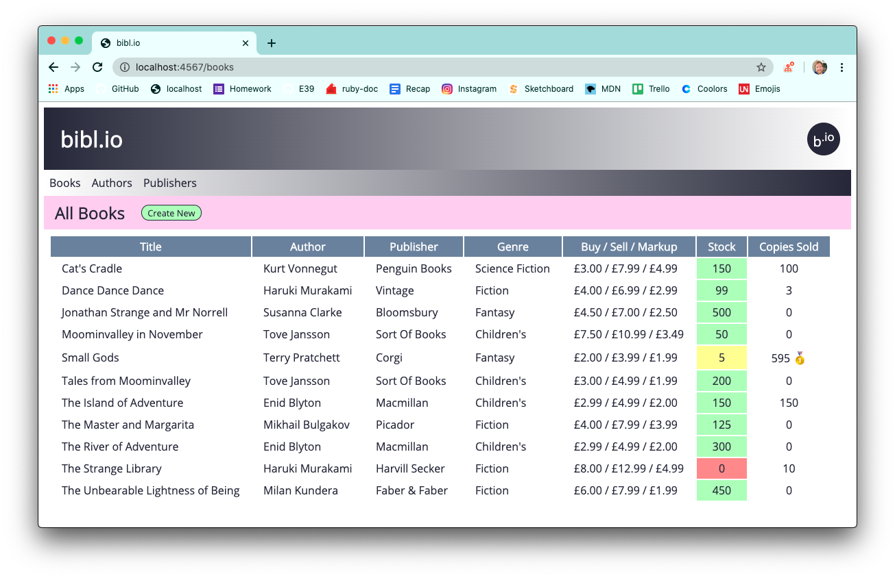
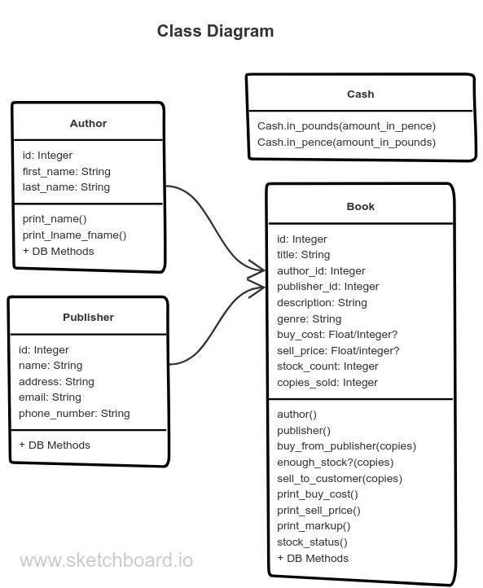

# `bibl.io`

`bibl.io` is a simple inventory management app for bookshops, written in Ruby with a Sinatra front-end and a PostgreSQL database.

Running instructions:
* Clone the repo
* Create a database called bookshop (`createdb bookshop`)
* Run db/bookshop.sql to create the required tables (`psql -d bookshop -f db/bookshop.sql`)
* Seed the database by running db/seeds.rb (`ruby db/seeds.rb`)
* Launch the app by running app.rb (`ruby app.rb`)
* Point your browser to `http://localhost:4567/`

## Original Brief

### Shop Inventory

Build an app which allows a shopkeeper to track their shop's inventory. This is not an app which the customer will see, it is an admin/management app for the shop workers.

#### MVP

* The inventory should track individual products, including a name, description, stock quantity, buying cost, and selling price.
* The inventory should track manufacturers, including a name and any other appropriate details.
* The shop can sell anything you like, but you should be able to create, edit and delete manufacturers and products separately.
  * This might mean that it makes more sense for a car shop to track makes and models of cars. Or a bookstore might sell books by author, or by publisher, and not by manufacturer. You are free to name classes and tables as appropriate to your project.
* Show an inventory page, listing all the details for all the products in stock in a single view.
* As well as showing stock quantity as a number, the app should visually highlight "low stock" and "out of stock" items to the user.

#### Inspired by

eBay, Amazon (back end only), Magento

#### Possible Extensions

* Calculate the markup on items in the store, and display it in the inventory.
* Filter the inventory list by manufacturer. For example, provide an option to view all books in stock by a certain author.
* Categorise your items. Books might be categorised by genre (crime, horror, romance) and cars might be categorised by type (SUV, coupé, hatchback). Provide an option to filter the inventory list by these categories.